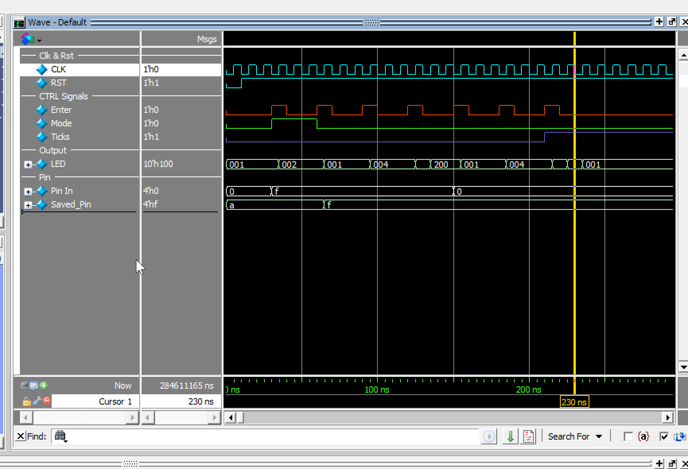

# FPGA Password Lock System V2

Second-generation FPGA password lock system designed in Verilog for the Intel MAX 10 DE10-Lite FPGA development board.

This project is a refactored and modular redesign of the original V1 implementation:

🔗 V1 Repository:  
https://github.com/DarkCyril/FPGA-Password-Lock-V1

V2 improves upon the original architecture by reducing FSM complexity, modularizing functionality, and adding scalable system features such as programmable password setup and lockout timing.

---

# Project Overview

The system allows a user to:

- Enter a 4-bit password
- Validate password input using FSM control logic
- Lock and unlock the system
- Set or modify stored passwords
- Trigger lockout behavior after an invalid attempt
- Display system status using LEDs 

The project was developed as a digital design learning project focused on:

- Finite State Machine (FSM) design
- RTL modularization
- Sequential logic design
- FPGA hardware debugging
- Quartus Prime FPGA development flow

---

# Hardware Platform

- FPGA Board: Intel MAX 10 DE10-Lite
- Language: Verilog HDL
- Toolchain: Intel Quartus Prime
- Verification: Simulation + On-board FPGA testing

---

# Improvements Over V1

| Feature | V1 | V2 |
|---|---|---|
| FSM States | 9 | 6 |
| Architecture | Monolithic FSM | Modular RTL Design |
| Password Handling | Fixed Password | Programmable PIN |
| Lockout Logic | Minimal | Countdown Timer |
| Scalability | Difficult to Extend | Easier to Maintain |
| Code Organization | Large Single FSM | Separated Modules |

---

# FSM Optimization

The original V1 implementation relied heavily on duplicated pause states for button handling:

- `PAUSE_0`
- `PAUSE_1`
- `PAUSE_2`
- `PAUSE_3`

V2 redesigned the FSM into a cleaner structure:

- `S_IDLE`
- `S_SET`
- `S_INPUT`
- `S_CHK`
- `S_UNBLK`
- `S_BLK`

Result:
- ~33% reduction in FSM state complexity
- cleaner state transitions
- improved maintainability
- easier feature expansion

---
# Project Structure

```text
FPGA-Password-Lock-V2/
├── constraints/
│   └── DE10-Lite pin assignments / constraint files
│
├── src/
│   ├── password_lock_top.v
│   ├── password_fsm.v
│   └── count_down.v
│
├── tb/
│   └── password lock testbench files
│
└── README.md
```
---

# Features

- Modular FSM-based architecture
- Password setup mode
- Password validation mode
- Lockout/block state
- Countdown timer module
- Seven-segment display output
- LED status indication
- FPGA hardware verified

---

# Resource Utilization

Quartus Prime compilation results:

| Resource | Usage |
|---|---|
| Logic Elements | 65 |
| Registers | 45 |
| Pins | 23 |
| Memory Bits | 0 |

---

# Future Improvements

Planned future versions may include:

- UART terminal integration
- Software-triggered reset/unlock commands
- Enhanced security logic

---

# Skills Demonstrated

- Verilog HDL
- Finite State Machines (FSMs)
- RTL Design
- FPGA Development
- Sequential Logic
- Hardware Debugging
- Quartus Prime
- Modular Hardware Architecture

---

## Simulation Waveform

The waveform below verifies the main FSM behavior of the Password Lock V2 design.



### Waveform Explanation

- `CLK` drives the synchronous FSM logic.
- `RST` initializes the system before normal operation begins.
- `Enter` is pulsed to simulate user confirmation/button input.
- `Mode` selects between normal password entry and password setup behavior.
- `Pin_In` represents the 4-bit PIN input from the user.
- `Saved_Pin` stores the programmed password value.
- `LED` is used as a visual debug output for FSM state/status indication.

During simulation, the design starts with the default saved PIN value `0xA`.  
When setup mode is enabled and `Pin_In` is changed to `0xF`, the FSM updates `Saved_Pin` from `0xA` to `0xF`.  

The LED output changes between state/status values such as `001`, `002`, `004`, and `200`, showing the FSM transitioning through idle, setup, check, and lock/unlock-related states.

This waveform confirms:
- reset behavior
- mode-controlled password setup
- saved PIN register update
- FSM state transitions
- LED-based state/status debugging
  
# Author

Juan Diego Colón Flores  
Electrical Engineering — Embedded Systems  
California State University, Los Angeles

GitHub: https://github.com/DarkCyril
